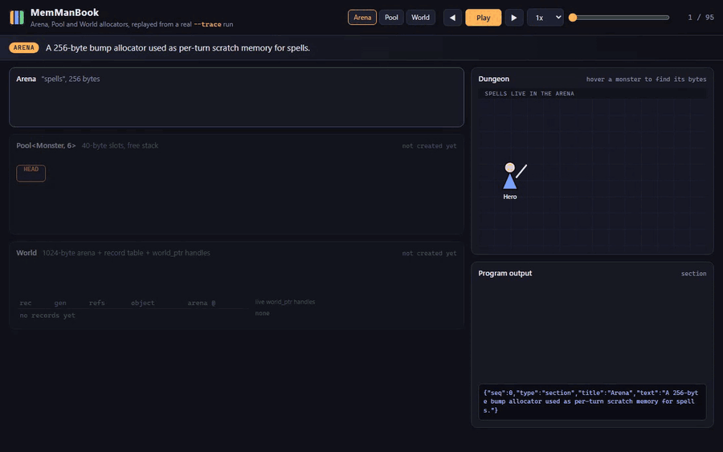
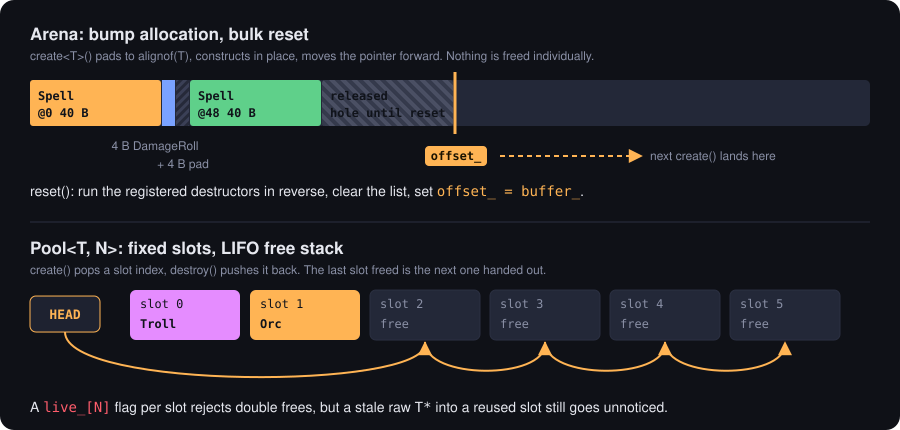
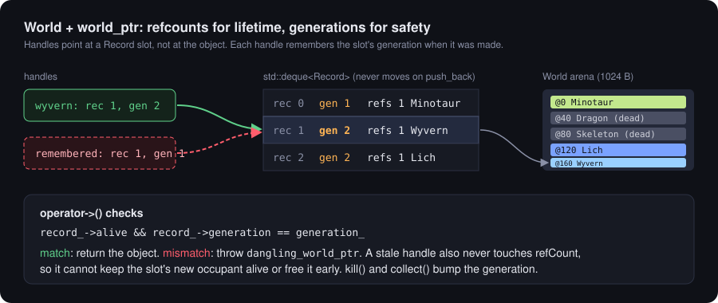
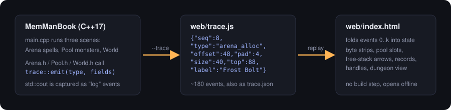
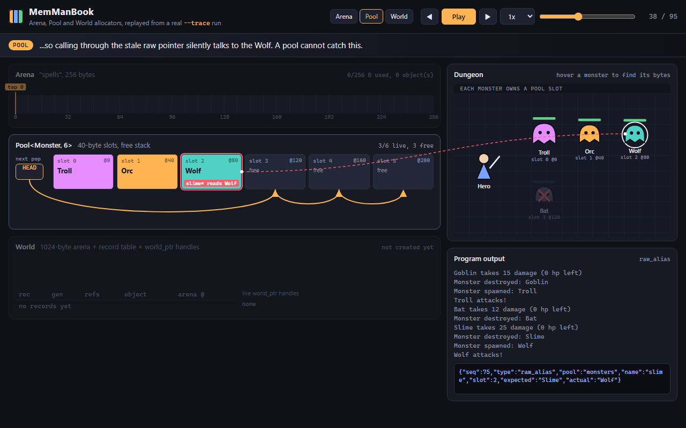
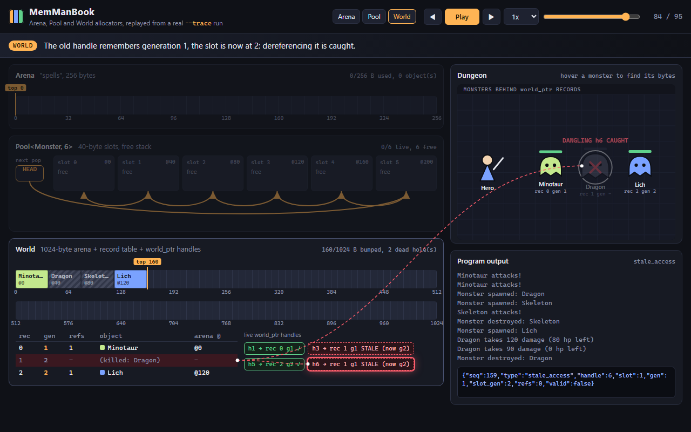
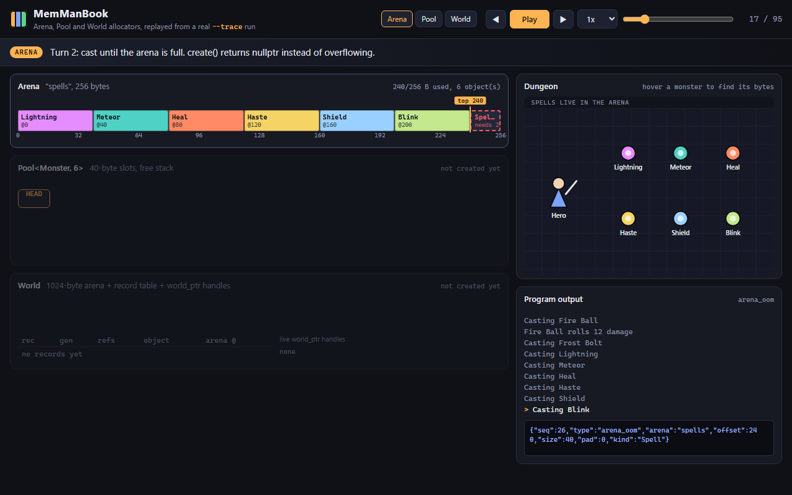

# MemManBook

**Live demo:** https://memory-management-phi.vercel.app

Three small C++ allocators for game objects (a bump arena, a fixed-slot pool, and a
reference-counted "world" with generation-checked handles), plus a web page that replays a
real run of the program byte by byte.



The recording is the `web/` visualizer playing `web/trace.js`, which the C++ program wrote with
`--trace`. Every block, arrow and generation number on screen comes from an event the allocators
emitted. A full-quality version is in [`docs/media/demo.mp4`](docs/media/demo.mp4).

## What it does

`main.cpp` runs three short scenes with `Spell` and `Monster` objects:

1. **Arena.** A 256-byte arena holds per-turn spell data. Allocations go back to back, a 4-byte
   `DamageRoll` forces 4 bytes of alignment padding before the next `Spell`, `reset()` runs the
   destructors and rewinds the pointer, and the seventh spell on a full arena gets `nullptr`.
2. **Pool.** `Pool<Monster, 6>` hands out 40-byte slots from a LIFO free stack. A Troll reuses the
   dead Goblin's slot. A Wolf moves into the Slime's slot, and the old `slime` pointer now reaches the
   Wolf without any error, which is exactly the bug a plain pool cannot catch. A second
   `destroy(bat)` is rejected, and the pool reports full when a seventh monster arrives.
3. **World.** Monsters live in an arena behind `world_ptr` handles. Copying a handle bumps a
   refcount, `collect()` destroys objects nobody refers to, and `kill()` destroys one immediately.
   A handle kept to the killed Dragon is then caught when dereferenced, and it stays stale after a
   Wyvern moves into the same record slot, because the generations no longer match.

Without flags the program just prints what happens. With `--trace` it writes the same run as
JSON events instead.

## How it works



**Arena** (`Arena.h`). One `operator new` buffer and a bump pointer. `create<T>()` computes the
padding for `alignof(T)`, checks the remaining space, placement-news the object and records a
type-erased destructor. `reset()` calls those destructors in reverse and rewinds. Individual objects
are never freed; `unregister_destructor()` only stops the arena from destroying something twice, so
its bytes stay as a hole until the next reset.

**Pool** (`Pool.h`). `N` slots of `sizeof(T)` bytes and a stack of free indices. `create()` pops,
`destroy()` pushes. A `live_` flag per slot makes double frees a no-op instead of putting the same
slot on the stack twice, and the destructor cleans up any objects still alive.



**World** (`World.h`, `world_ptr.h`). Objects are allocated from an arena and each gets a `Record`
with a refcount, a type-erased destructor, an `alive` flag and a generation. Records live in a
`std::deque`, which never moves existing elements on `push_back`, so the `Record*` inside a handle
stays valid. Freed record slots are reused, and every release bumps the slot's generation. A
`world_ptr` stores the record and the generation it was created with; `operator->` throws
`dangling_world_ptr` if they differ, and a stale handle never touches the refcount of whatever
lives in the slot now.



**Tracing** (`Trace.h`). The allocators call `trace::emit(type, fields)` at each interesting point
(`arena_alloc`, `arena_reset`, `pool_alloc` with the free stack, `world_spawn`, `handle_copy`,
`stale_access`, ...). When tracing is off each hook is a single bool check. In trace mode
`std::cout` is swapped for a stream buffer that turns printed lines into `log` events, so the
viewer can show the program's own output next to the memory. A path ending in `.js` is written as
`window.MEMMAN_TRACE = {...}` so the page works from `file://` without a server.

The viewer (`web/app.js`) keeps no allocator logic of its own. For step *k* it folds events
`0..k` into a state object and renders that: byte strips for both arenas with padding and dead
holes hatched, the bump pointer, pool slots with the free stack drawn as arrows from `HEAD`, the
record table and live handles, and a dungeon view where each monster sits at its pool slot or
record. Hovering a monster draws a line to its bytes.

| Pool free stack and the aliasing raw pointer | Stale handle caught after `kill()` |
|---|---|
|  |  |



## Quick start

Build with g++ (C++17, no other dependencies):

```bash
g++ -std=c++17 -Wall -Wextra -O2 -o memman main.cpp Arena.cpp Monster.cpp Pool.cpp Spell.cpp World.cpp world_ptr.cpp
./memman                            # plain console output
./memman --trace web/trace.js       # regenerate the viewer's data (also: trace.json, or - for stdout)
```

Or with CMake (any generator; on Windows the default is Visual Studio):

```bash
cmake -S . -B build
cmake --build build --config Release
cmake --build build --config Release --target trace   # writes web/trace.js and web/trace.json
```

`MemManBook.slnx` / `MemManBook.vcxproj` still open and build in Visual Studio as before.

Open the viewer by double-clicking `web/index.html`, or serve it:

```bash
python -m http.server 8103 --directory web
# http://localhost:8103
```

Controls: Play/Pause (Space), step with the arrow keys, drag the scrubber, jump to a scene with the
Arena / Pool / World buttons, change speed. `?step=83` opens at a given step and `?autoplay=1`
starts playing.

## Layout

```
Arena.h          bump allocator with destructor list
Pool.h           fixed-slot pool with free stack and live flags
World.h          arena-backed object world: spawn / kill / collect
world_ptr.h      Record + refcounted, generation-checked handle
Trace.h          JSON event builder used by --trace
Monster.h Spell.h  demo objects (trace_label / trace_kind overloads)
main.cpp         the three scenes and the --trace switch
*.cpp            one-line translation units kept for the VS project
CMakeLists.txt   CMake build + "trace" target
web/             index.html, app.js, style.css, trace.js (generated), trace.json (generated)
docs/media/      demo.gif, demo.mp4, screenshots, SVG diagrams
```

## Design notes and trade-offs

- **The arena never frees in the middle.** That is the point of it: allocation is a pointer bump
  and cleanup is one pass. The cost is visible in the World scene, where collected and killed
  monsters leave dead holes until the arena resets. A long-running world would want a pool or a
  free list underneath instead.
- **Pool free order.** Slots are handed out 0, 1, 2, ... at first, then last-freed-first. LIFO reuse
  keeps recently touched memory hot, and it is also what makes the stale-pointer case so easy to
  hit.
- **Refcount plus generation.** The refcount decides *when* an object may be collected; the
  generation decides whether a handle is still *allowed* to reach it. `kill()` exists because games
  often need to remove an entity while other systems still hold references, and those references
  should fail loudly rather than read someone else's memory.
- **Tracing cost.** Hooks stay in release builds but are a branch on a static bool. Building the
  JSON strings only happens with `--trace`.

### Bugs fixed while adding the visualizer

- `Arena::reset()` did not clear its destructor list, so the manual `reset()` in `main` followed
  by `~Arena` destroyed the same objects twice.
- `Arena::create()` advanced the pointer for padding before checking capacity, so a failed
  allocation could still move it (and push it past the end).
- `World` stored records in a `std::vector` and handed out `Record*`. The next `spawn()` could
  reallocate the vector, and `collect()` erased from the middle, so existing handles pointed at
  freed or shifted memory.
- `world_ptr` had no copy assignment, so `a = b` copied the pointer without touching refcounts.
- `Pool` accepted double frees and never destroyed objects still alive when it went away.
- `World::spawn()` ignored a full arena and built a record around `nullptr`.

## License

Provided as-is for educational purposes.
